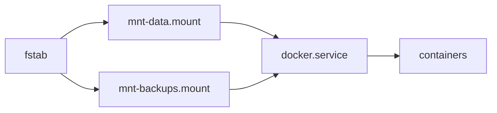

# Media Server — Storage Setup

The media server has 3 physical HDDs:

| Drive | Mount point | Purpose | Notes |
|-------|-------------|---------|-------|
| HDD 1 | `/` + `/home` | System, OS, user home | Internal boot drive |
| HDD 2 | `/mnt/data` | Containers, media libraries | Main data pool |
| HDD 3 | `/mnt/backups` | Backups, archives | Redundant/secondary |

This doc covers mounting HDD 2 and HDD 3 so they survive reboots and Docker
waits for them before starting containers.

---

## 1. Identify drives

```bash
sudo blkid | grep -E '(sd[b-z][0-9]|nvme[0-9]+n[0-9]+p[0-9]+)'
```

Output looks like:

```
/dev/sdb1: UUID="abc-123" TYPE="ext4" PARTLABEL="data"
/dev/sdc1: UUID="def-456" TYPE="ext4" PARTLABEL="backups"
```

**Always use UUID**, not device names (`sdb1`, `sdc1`). Device names can
change when you reboot, add a USB drive, or the kernel reorders SCSI devices.
UUID is stable for the lifetime of the filesystem.

---

## 2. Mount points

```bash
sudo mkdir -p /mnt/data /mnt/backups
```

---

## 3. fstab entries

Backup first:

```bash
sudo cp /etc/fstab /etc/fstab.bkp
```

Append to `/etc/fstab`:

```bash
sudo tee -a /etc/fstab << 'FSTAB'

# ── Data drive ────────────────────────────────────────────
UUID=abc-123  /mnt/data    ext4  defaults,nofail  0  2

# ── Backups drive ─────────────────────────────────────────
UUID=def-456  /mnt/backups ext4  defaults,nofail  0  2
FSTAB
```

Replace `abc-123` / `def-456` with the actual UUIDs from step 1.

**`nofail`** — if a drive is missing at boot, the system continues normally
instead of dropping into emergency mode waiting for the mount.

The `0 2` at the end means:
- `0` — dump (backup utility, almost never used)
- `2` — fsck order (1 = root, 2 = other local drives, skip = no check)

---

## 4. Apply and verify

```bash
sudo mount -a          # mount everything from fstab
df -h /mnt/data /mnt/backups   # confirm they're mounted
```

If `mount -a` succeeds with no errors, the next reboot will also work.

---

## 5. LABEL (alternative to UUID)

If you prefer human-readable entries:

```bash
sudo e2label /dev/sdb1  data
sudo e2label /dev/sdc1  backups
```

Then use labels in fstab instead of UUIDs:

```bash
LABEL=data     /mnt/data    ext4  defaults,nofail  0  2
LABEL=backups  /mnt/backups ext4  defaults,nofail  0  2
```

---

## 6. Make Docker wait for the mounts

Without this step, Docker may start before the HDDs are mounted. Containers
with bind mounts to `/mnt/data` or `/mnt/backups` will either fail to start
or have empty directory shadows.

Create a drop-in override for the Docker service:

```bash
sudo mkdir -p /etc/systemd/system/docker.service.d/

sudo tee /etc/systemd/system/docker.service.d/mount-wait.conf << 'EOF'
[Unit]
After=mnt-data.mount mnt-backups.mount
RequiresMountsFor=/mnt/data /mnt/backups
EOF
```

Then reload and restart:

```bash
sudo systemctl daemon-reload
sudo systemctl restart docker
```

### How it works

Systemd converts every `fstab` entry into a `.mount` unit. The file
`/etc/fstab` entry for `/mnt/data` becomes `mnt-data.mount`. By adding
`RequiresMountsFor` and `After`, Docker's service unit won't start until
both mount units have completed successfully.

You can check the generated mount units:

```bash
systemctl list-units --type=mount --all | grep mnt
```

---

## 7. Verify the chain

```bash
systemctl list-dependencies docker.service | grep mnt
```

Expected output:

```
● mnt-backups.mount
● mnt-data.mount
```

---

## Troubleshooting

### Drive not mounting after reboot

```bash
sudo journalctl -u mnt-data.mount   # check why it failed
sudo mount /mnt/data                # mount manually to see the error
```

### Wrong filesystem type on fstab

Use `blkid` to confirm the actual filesystem type (`ext4`, `xfs`, `btrfs`,
etc.) and match it in fstab's third column.

### Permissions on mount point

```bash
sudo chown 1000:1000 /mnt/data
sudo chmod 755 /mnt/data
```

Adjust UID/GID to match the user that runs Docker containers.

---

## Summary



1. `blkid` → get UUIDs
2. `fstab` → add entries with `nofail`
3. `mount -a` → test
4. `mount-wait.conf` → Docker waits
5. `restart docker` → apply
